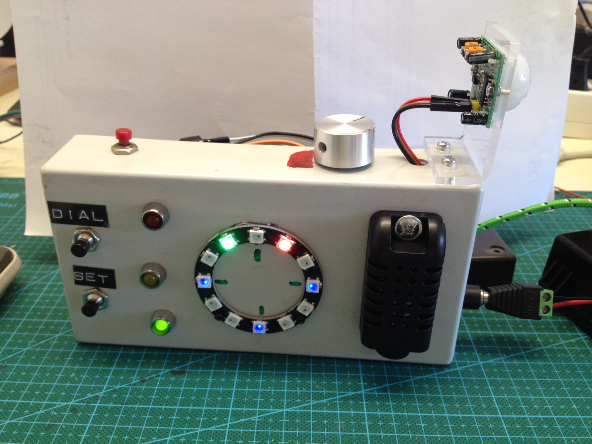

# Alarm clock
Alarm clock that gets system time from my server. Not only it measures temperature and humidity in my bedroom, but also 
checks for movements. In the night, because my eye sight is not too good, the time is displayed by a Neopixel ring. You can set
an alarm to wake you in the morning. I use an Arduino Nano to do all the IO's and an ESP01 for communicating through
the wifi network. You may also use a Wemos D1 mini instead but I like to use up my Nanos and ESP01s for that purpose.
See also the PCB Board in Eagle I developped for this project.

OK, it does not look very exciting but there are a lot of topics that are covered with this project, such as:
* Communication between Arduino Nano and ESP01 through Json
* Displaying time with a Neopixel ring
* Using MQTT to request time from the server
* Using node-red to extract time from the server and make it available to my home automation nodes

It is one o'clock and 55 minutes.

## How It Works
- when the clock starts up the ESP01 requests the system time from the server through MQTT and Node-red
- The ESP01 also communicates the temperature and humidity as well as movements to MQTT and ultimately to Domoticz
- The Arduino Nano does all the IO's, drives the Neopixels and reports to the ESP01 via json
- Press the Set switch to set the alarm, press the dial switch to change alarm time, press the panic switch to display time
  and to snooze when alarm goes off.
- The time is displayed like the hour beeing a red and the minutes beeing a green LED on the Neopixel ring.

